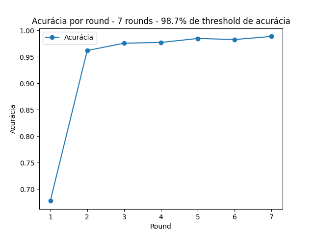
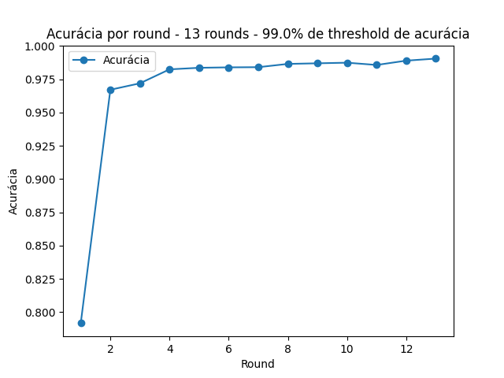
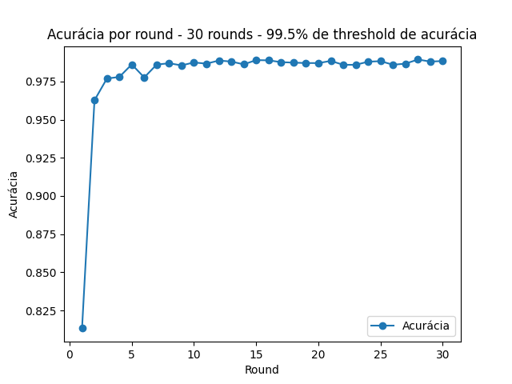

# Experimento de Acurácia em Diferentes Execuções


O resultado esperado ao utilizar a técnica de aprendizado federado com comunicação baseada em MQTT é exatamente o aumento gradual da acurácia ao longo dos rounds, até atingir um máximo local. 

O modelo de aprendizado federado permite treinar um modelo de forma distribuída em vários dispositivos, utilizando a comunicação baseada em MQTT (Message Queuing Telemetry Transport), garantimos uma troca eficiente de informações entre os dispositivos participantes. Esperava-se que, conforme os dispositivos colaborassem no treinamento do modelo, a acurácia aumentasse progressivamente à medida que mais dados e conhecimentos locais fossem agregados. No entanto, é importante ressaltar que, em algum ponto, a acurácia poderia atingir um máximo local, indicando que o modelo atingiu sua capacidade máxima de aprendizado com os dados disponíveis e as limitações do algoritmo empregado.

Neste experimento, foram realizadas três execuções utilizando um modelo dado em aula para treinar e avaliar a acurácia. Cada execução teve um número máximo de rounds e uma meta de acurácia diferentes. O dataset utilizado foi o MNIST, amplamente utilizado em problemas de classificação de dígitos escritos à mão.

A seguir estão detalhadas as três execuções realizadas:

## Execução 1

- Número máximo de rounds: 15 (executados 7)
- Meta de acurácia: 98.7%

Na primeira execução, estabelecemos um limite de 15 rounds e uma meta de acurácia de 98.7%. Durante os rounds, o modelo foi treinado e a acurácia foi medida. O gráfico abaixo mostra o aumento da acurácia ao longo dos rounds:



## Execução 2

- Número máximo de rounds: 20 (executados 13)
- Meta de acurácia: 99.0%

Na segunda execução, aumentamos o número máximo de rounds para 20 e estabelecemos uma meta de acurácia de 99.0%. Novamente, o modelo foi treinado e a acurácia foi registrada a cada round. O gráfico a seguir apresenta o aumento gradual da acurácia:



## Execução 3

- Número máximo de rounds: 30 (executados 30, acurácia não alcançada)
- Meta de acurácia: 99.5%

Na terceira e última execução, ampliamos ainda mais o número máximo de rounds para 30 e estabelecemos uma meta de acurácia de 99.5%. O modelo foi treinado e avaliado ao longo dos rounds, obtendo uma crescente melhoria na acurácia. O gráfico abaixo ilustra esse progresso:



Em todas as execuções, observamos um aumento consistente na acurácia à medida que o número de rounds aumentava. Esses resultados demonstram a capacidade do modelo de aprender e se adaptar ao dataset MNIST, alcançando metas de acurácia cada vez mais altas, até atingir um máximo local.

## Sobre o programa

Este programa em Python implementa um sistema de aprendizado federado. Para executar o programa, são necessárias algumas dependências e etapas adicionais. Siga as instruções abaixo para configurar e executar o programa.

## Pré-requisitos

Certifique-se de ter os seguintes pré-requisitos instalados em seu sistema:

- Python 3: É necessário ter o Python 3 instalado. Você pode baixar a versão mais recente do Python em https://www.python.org/downloads/.

- Bibliotecas Python: As seguintes bibliotecas Python são necessárias e podem ser instaladas usando o gerenciador de pacotes `pip`:

  ```
  pip install paho-mqtt pandas matplotlib
  ```

- Docker e Docker Compose: O programa utiliza um broker MQTT localizado em um contêiner Docker. Você deve ter o Docker e o Docker Compose instalados para iniciar o broker. Você pode obter as instruções de instalação do Docker em https://docs.docker.com/get-docker/ e do Docker Compose em https://docs.docker.com/compose/install/.

## Configuração

Antes de iniciar o programa, é necessário configurar o broker MQTT. Siga as etapas abaixo:

1. Abra um terminal e navegue até o diretório raiz do projeto.

2. Execute o seguinte comando para iniciar o broker MQTT no contêiner Docker:

   ```
   sh start_local_broker.sh
   ```

   Isso iniciará o broker MQTT localmente no endereço `localhost:1883`.

## Executando o Programa

Após configurar o broker MQTT, você pode executar o programa. Siga as etapas abaixo:

1. Abra um terminal e navegue até o diretório raiz do projeto.

2. Execute o seguinte comando para iniciar o cliente:

   ```
   python3 client.py [--mqttserver <host:port>]
   ```

   O parâmetro opcional `--mqttserver` permite especificar o endereço do servidor MQTT. Se não for fornecido, o valor padrão é `localhost:1883`, que se refere ao broker MQTT local.

   Exemplo de uso:

   ```
   python3 client.py --mqttserver mymqttserver.com:1883
   ```

   Isso iniciará o cliente e ele se conectará ao broker MQTT especificado.

## Parando o Broker MQTT

Após concluir a execução do programa, você pode parar o broker MQTT usando o seguinte comando:

```
sh stop_local_broker.sh
```

Isso encerrará o broker MQTT em execução no contêiner Docker.

Espero que as informações acima sejam úteis para configurar e executar o programa de aprendizado federado. Se você tiver alguma dúvida adicional, sinta-se à vontade para perguntar.